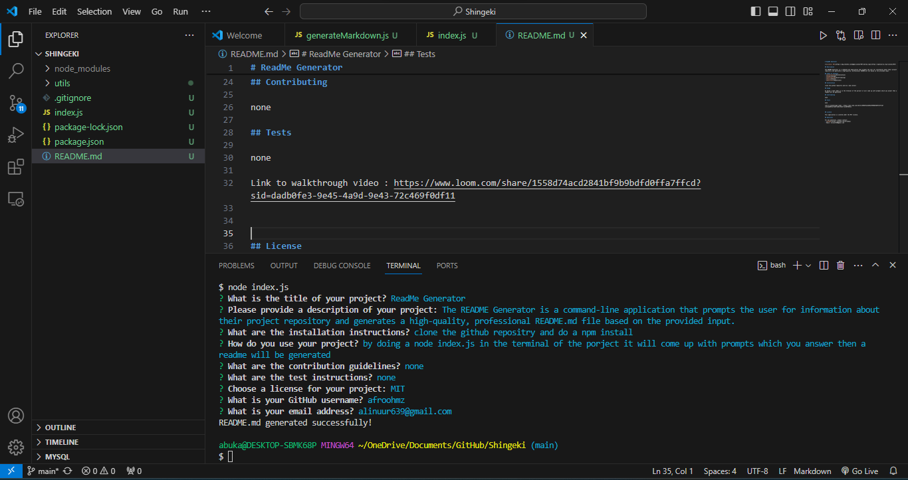

# ReadMe Generator

## Description

The README Generator is a command-line application that prompts the user for information about their project repository and generates a high-quality, professional README.md file based on the provided input.

## Table of Contents
- [Installation](#installation)
- [Usage](#usage)
- [Contributing](#contributing)
- [Tests](#tests)
- [Questions](#questions)

## Installation

clone the github repositry and do a npm install

## Usage

by doing a node index.js in the terminal of the porject it will come up with prompts which you answer then a readme will be generated 

## Contributing

none

## Tests

none

Link to walkthrough video : https://www.loom.com/share/1558d74acd2841bf9b9bdfd0ffa7ffcd?sid=dadb0fe3-9e45-4a9d-9e43-72c469f0df11

## License

This application is covered under the MIT license.

## Questions

For any questions, please contact:
- [GitHub](https://github.com/afroohmz)
- Email: alinuur639@gmail.com
